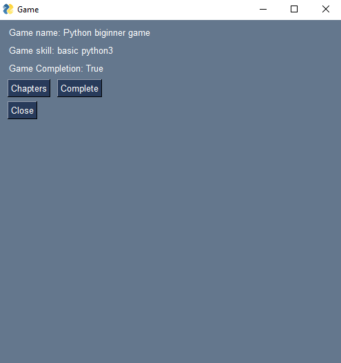
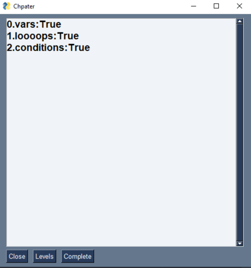

# Progature

## Summary
*Progature* is a programming advanture game writen with ``python``. <br>
This project is completely **offline** and can run on your machine. <br>
Main reason why I started this project was that I want to learn something, but I need to see my progress in my learning jurney, this tool lets you create *Games*, each *Game* has one *Skill* to achive and some *Chapters* to complete, these *Chapters* contain number of *Levels* and each *Level* has some *Quests*. <br>
With this structure you can keep your learning data and watch your progress through out your learning jurney, this makes you more **motivated**, **efficient** and **organized** in your learnings.

## What is **Progature**
*Progature* is a platform that makes learning process into **FUN** game, personally when I want to start learning something (mostly in tech) I don't know where to start, what to learn. <br>
**Long story short *Progature* is a real life *RPG* game, where you achive and collect skill's and improve yourself.**
<br>
In this situation I start to look what to learn and lookup for topics, **Progature** lets you store these topics into game components, top level component is *Game* itself, within a *Game* you want to achive/learn a skill so we have *Skill* component for each *Game*. <br>
So now you have collect all topics you want to learn, its time to use *Chapter* component, *Chapter* is like a *Spring*, its a part of the skill you want to learn. Then there is *Level* and this component is actually the sub part of your main topic, and there is *Quest*, quest's are component that store actions for you to achive a *Level*, think about quest's as works you need to do to learn/complete a *Level* of the game.

## Preview




## Installation

first install requirements

```bash
pip install -r requirements.txt
```

then run ``main.py``
```bash
python progature/main.py
```

## Contribute
There are several ways you can support this project. <br>

* Implement better **GUI**
* Create more **Games**
* Write better **Docs**
* Best way is to just use it and suggest new **Features**